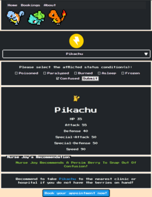
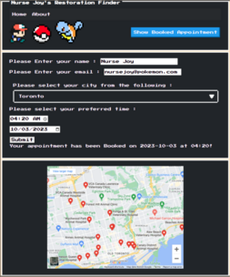
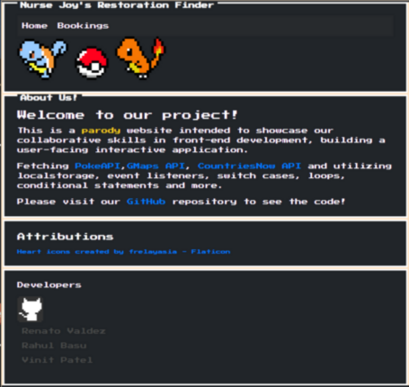

# Nurse Joys Restoration Finder

A Canadian-based Veterinary clinic finder with suggestions of treatment based on your Pokemon's status condition! All information is locally stored and can be referred back to.

Fetching [PokeAPI](https://pokeapi.co/docs/v2), [GMaps API](https://developers.google.com/maps/documentation/embed/quickstart), and [CountriesNow API](https://countriesnow.space/). Utilizing localstorage, event listeners, switch cases, loops, conditional statements, and more.

## Application 
[Application Deployment](https://r-basu.github.io/nurse-joys-restoration-finder)

We have 4 HTML files in our application.

- index.html
- main.html
- booking.html
- about.html

### index.html

The user can select their Pokemon's type to proceed to retrieve their Nurse Joy recommedation and appointment. The booking appointment form only appears when there is saved information.

### main.html

Here the user selects their Pokemon, a list is retrieved based on the type selected, and a checklist of status conditions that the user will correspond to their Pokemon's condition. Upon submitting the info, the page will return the recommended cure, as well as information about the selected Pokemon. The button at the end of the page will take the user to the appointment booking form. 

### booking.html

The user can input their relevant information and be shown vet clinics near them by default, or select a Canadian-based city. The information is saved locally on the browser where it is accessible for the user to return and view/change or clear their appointment from the index.html or booking.html page.

### about.html

## Project Tracker
- [Project Tracker](https://github.com/users/r-basu/projects/1/views/1)
- [Issues Tracker](https://github.com/r-basu/nurse-joys-restoration-finder/issues?q=is%3Aissue+is%3Aclosed)

### Release v1.0.0

## Developers

* [Vinit Patel](https://github.com/vinitp2)
* [Renato Valdez](https://github.com/Ren3546)
* [Rahul Basu](https://github.com/r-basu)

