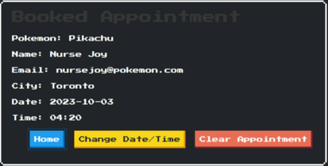

# Nurse Joys Restoration Finder

A Canadian based Vetinary clinic finder with suggestions of treatment based on your pokemon's status condition! With stored booking information locally to check back onto!

Fetching [PokeAPI](https://pokeapi.co/docs/v2), [GMaps API](https://developers.google.com/maps/documentation/embed/quickstart), [CountriesNow API](https://countriesnow.space/) and utilizing localstorage, event listeners, switch cases, loops, conditional statements and more.

## Application 
[Application Deployment](https://r-basu.github.io/nurse-joys-restoration-finder)

We have 4 HTML files in our application.

- index.html
- main.html
- booking.html
- about.html

### index.html

The user can select their pokemon type to proceed to retrieve their Nurse Joy recommedation and appointment. The booking appointment form only appears when there is saved information.

### main.html

Here, the user selects their pokemon, list retrieved based on type selected, and the status conditions affecting the pokemon. Returning the recommended cure, as well as information about the selected pokemon and a button to proceed to the appointment form.

### booking.html

The user can input their relevant information and be shown Vet clinics near them by default, or select a Canadian based city. The information is saved locally on the browser for the user to be able to return and view/change or clear their appointment from the index.html or booking.html page.

### about.html

### Developers

* [Vinit Patel](https://github.com/vinitp2)
* [Renato Valdez](https://github.com/Ren3546)
* [Rahul Basu](https://github.com/r-basu)

